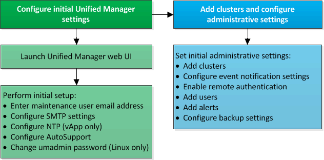

= Présentation de la séquence de configuration
:allow-uri-read: 
:icons: font
:imagesdir: ../media/

[role="lead"]
Le workflow de configuration décrit les tâches que vous devez effectuer avant d'utiliser Unified Manager.

