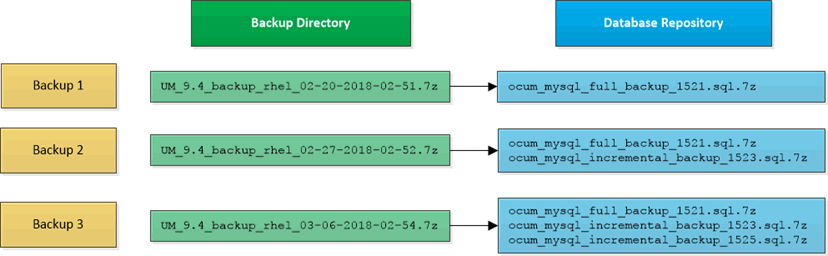

= Qu'est-ce qu'une sauvegarde de base de données
:allow-uri-read: 
:icons: font
:imagesdir: ../media/

[role="lead"]
Une sauvegarde est une copie de la base de données et des fichiers de configuration Unified Manager que vous pouvez utiliser en cas de défaillance système ou de perte de données. Vous pouvez planifier l'écriture d'une sauvegarde vers une destination locale ou distante. Il est vivement recommandé de définir un emplacement distant externe au système hôte Unified Manager.

Une sauvegarde consiste en un seul fichier dans le répertoire de sauvegarde et un ou plusieurs fichiers dans le répertoire de référentiel de base de données. Le fichier du répertoire de sauvegarde est très petit car il ne contient qu'un pointeur vers les fichiers situés dans le répertoire du référentiel de base de données qui sont nécessaires pour recréer la sauvegarde.

La première fois que vous générez une sauvegarde, un seul fichier est créé dans le répertoire de sauvegarde et un fichier de sauvegarde complet est créé dans le répertoire du référentiel de base de données. La prochaine fois que vous générez une sauvegarde, un seul fichier est créé dans le répertoire de sauvegarde et un fichier de sauvegarde incrémentielle est créé dans le répertoire de référentiel de base de données qui contient les différences du fichier de sauvegarde complet. Ce processus se poursuit au fur et à mesure que vous créez des sauvegardes supplémentaires, jusqu'au paramètre de rétention maximum, comme indiqué dans la figure suivante.

[NOTE]
====
Ne renommez pas et ne supprimez aucun des fichiers de sauvegarde dans ces deux répertoires, sinon toute opération de restauration ultérieure échouera.

====
Si vous écrivez vos fichiers de sauvegarde sur le système local, vous devez lancer un processus pour copier les fichiers de sauvegarde vers un emplacement distant afin qu'ils soient disponibles en cas de problème système nécessitant une restauration complète.

Avant de commencer une opération de sauvegarde, Unified Manager effectue une vérification d'intégrité pour vérifier que tous les fichiers de sauvegarde et répertoires de sauvegarde requis existent et sont inscriptibles. Il vérifie également qu'il y a suffisamment d'espace sur le système pour créer le fichier de sauvegarde.

Notez que vous ne pouvez restaurer une sauvegarde que sur la même version d'Unified Manager. Par exemple, si vous avez créé une sauvegarde sur Unified Manager 9.4, la sauvegarde ne peut être restaurée que sur les systèmes Unified Manager 9.4.
