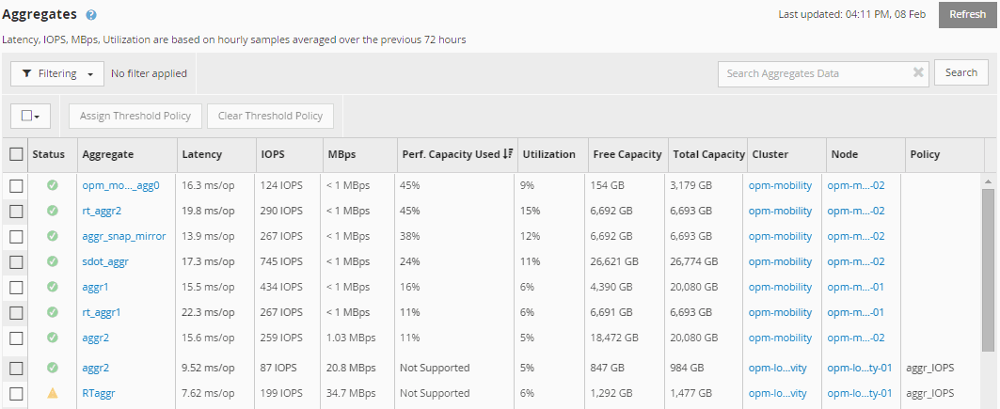

= Affichage des valeurs de capacité des nœuds et des performances des agrégats utilisées
:allow-uri-read: 
:icons: font
:imagesdir: ../media/

[role="lead"]
Vous pouvez contrôler les valeurs de performance de la capacité utilisée pour tous les nœuds ou pour tous les agrégats d'un cluster, ou afficher les détails d'un nœud ou agrégat unique.

Les valeurs utilisées relatives à la capacité de performance apparaissent dans le Tableau de bord des performances, les pages Inventaire des performances, la page collaborateurs les plus performants, la page Créer une stratégie de seuil, les pages Explorateur de performances et les graphiques détaillés. Par exemple, la page Inventaire des performances/agrégats fournit une colonne Perf. La capacité utilisée pour afficher la valeur des performances utilisées pour tous les agrégats.

L'état « N/A » s'affiche lorsque les nœuds ne sont pas installés avec le logiciel ONTAP 9.0 ou version ultérieure.

Le contrôle du compteur de performances utilisé vous permet d'identifier ce qui suit :

* Que les nœuds ou les agrégats de n'importe quel cluster disposent d'une capacité haute performance utilisée
* Que des nœuds ou des agrégats de tous les clusters disposent d'événements de capacité de performances active
* Les nœuds et les agrégats qui présentent la capacité de performance la plus élevée et la plus faible au sein d'un cluster
* Les valeurs des compteurs de latence et d'utilisation associées à des nœuds ou des agrégats qui possèdent des valeurs de capacité haute performance utilisée
* L'impact des valeurs de performance utilisées pour les nœuds d'une paire haute disponibilité sera affecté en cas de panne de l'un des nœuds
* Les volumes et les LUN les plus sollicités d'un agrégat dont les capacités de performances sont élevées

