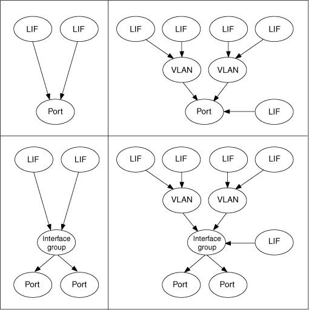

= En quoi consistent les LIF
:allow-uri-read: 
:icons: font
:imagesdir: ../media/

[role="lead"]
Une LIF (interface logique) est une adresse IP ou un WWPN avec des caractéristiques associées, telles qu'un rôle, un port de rattachement, un nœud de rattachement, la liste des ports à basculer et une politique de pare-feu. Vous pouvez configurer les LIF sur les ports sur lesquels le cluster envoie et reçoit des communications sur le réseau.

Les LIFs peuvent être hébergées sur les ports suivants :

* Ports physiques ne faisant pas partie de groupes d'interfaces
* Groupes d'interface
* VLAN
* Ports physiques ou groupes d'interfaces qui hébergent des VLAN
* Ports VIP (Virtual IP
+
À partir de ONTAP 9.5, les LIFs VIP sont prises en charge et hébergées sur des ports VIP.

Lors de la configuration des protocoles SAN tels que FC sur une LIF, ils seront associés à un WWPN.

http://docs.netapp.com/ontap-9/topic/com.netapp.doc.dot-cm-sanag/home.html["Guide d'administration du SAN ONTAP 9"]

La figure suivante illustre la hiérarchie de ports dans un système ONTAP :

