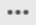

= Personnalisation du rapport événements pour afficher des événements avec un type de gravité critique
:allow-uri-read: 
:icons: font
:imagesdir: ../media/

[role="lead"]
Vous pouvez personnaliser le rapport événements pour afficher les événements filtrés par type de gravité et par les événements qui n'ont pas été résolus pendant la période la plus longue.

== Description de la tâche

Vous pouvez également effectuer cette tâche en allant sur la page Rapports et en cliquant sur *Exécuter le rapport* pour le rapport approprié.

== Étapes

. Pour filtrer les événements ayant un type de gravité critique, cliquez dans la colonne *État* et ouvrez la boîte de dialogue *filtre* en cliquant sur le bouton image:../media/click-to-filter.gif[""] icône.
. Dans la liste *condition*, sélectionnez *Egal à*.
. Cliquez sur *Sélectionner les valeurs* et sélectionnez *critique*.
. Cliquez sur *OK*.
. Pour trier les événements qui ne sont pas résolus pour la période la plus longue, cliquez dans la colonne *jours en suspens*, puis cliquez sur le bouton  icône.
. Sélectionnez *filtre* > *N haut/bas*.
. Dans la boîte de dialogue *Haut/Bas N*, sélectionnez *Haut N* dans le champ *filtre* et entrez une valeur dans le champ de texte.
. Cliquez sur *OK*.

