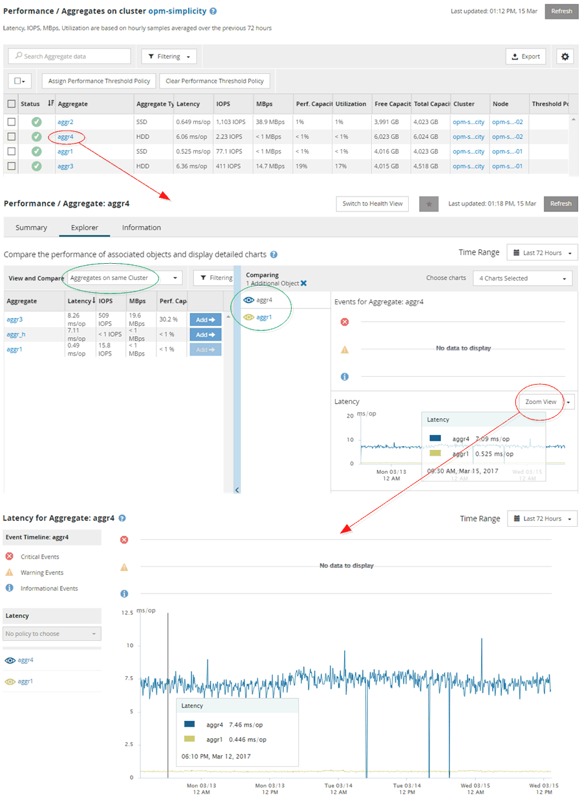

= Contrôle la navigation sur les performances du cluster
:allow-uri-read: 
:icons: font
:imagesdir: ../media/

[role="lead"]
Unified Manager vous permet de contrôler les performances de tous les clusters gérés par Unified Manager. La surveillance des clusters offre une vue d'ensemble des performances du cluster et des objets, et inclut la surveillance des événements de performance. Vous pouvez afficher les performances et les événements de haut niveau. Vous pouvez également étudier plus en détail les événements de performance et de performance du cluster et des objets.

Voici un exemple de nombreux chemins de navigation de performances de cluster possibles :

. Dans la page tableaux de bord/performances, identifiez un cluster à rechercher et cliquez sur *Afficher les détails du cluster* pour accéder à la page d'accueil du cluster sélectionné.
. À partir de la page Performance/Cluster Summary, identifiez le type d'objet que vous souhaitez rechercher et cliquez dessus pour afficher la page d'inventaire des objets.
+
Dans cet exemple, *Aggregates* est sélectionné et affiche la page d'inventaire performances/agrégats.

. Dans la page Performance/Aggregates, identifiez l'agrégat à étudier et cliquez sur ce nom pour accéder à la page Performance/agrégat Explorer.
. Vous pouvez également sélectionner d'autres objets à comparer avec cet agrégat dans le menu Affichage et comparaison, puis ajouter un des objets au volet comparaison.
+
Les statistiques des deux objets s'affichent dans les compteurs pour comparaison.

. Dans le volet comparaison situé à droite de la page de l'Explorateur, cliquez sur *vue Zoom* dans l'un des diagrammes pour afficher des détails sur l'historique des performances de cet agrégat.

