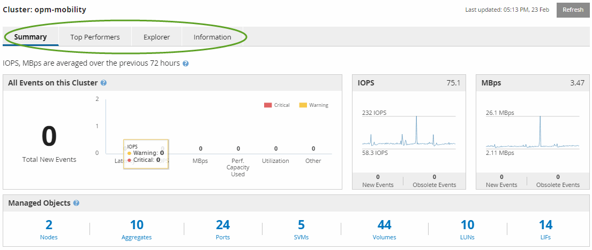

= Comprendre la page d'accueil de Performance Cluster
:allow-uri-read: 
:icons: font
:imagesdir: ../media/

[role="lead"]
La page d'accueil Performance Cluster fournit une vue d'ensemble des performances de haut niveau d'un cluster sélectionné, en insistant sur l'état des performances des 10 objets les plus importants du cluster. Les problèmes de performances s'affichent en haut de la page, dans le panneau tous les événements de ce cluster.

La page d'accueil Performance Cluster offre une présentation générale de chaque cluster géré par une instance de Unified Manager. Cette page fournit des informations sur les événements et les performances. Elle vous permet également de contrôler et de dépanner les clusters. L'image suivante montre un exemple de la page d'accueil du cluster Performance Cluster pour le cluster appelé opm-Mobility :

Le nombre d'événements sur la page Cluster Summary peut ne pas correspondre au nombre d'événements sur la page Performance Event Inventory. En effet, la page Cluster Summary peut afficher un événement dans les barres latence et utilisation lorsque les règles de seuil de combinaison ont été enfreintes, alors que la page Performance Event Inventory n'affiche qu'un seul événement lorsqu'une règle de combinaison a été enfreinte.

[NOTE]
====
Si un cluster a été supprimé d'être géré par Unified Manager, l'état *supprimé* s'affiche à droite du nom du cluster en haut de la page.

====