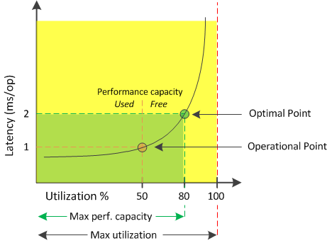

= Quelle est la capacité des performances utilisée
:allow-uri-read: 
:icons: font
:imagesdir: ../media/

[role="lead"]
Le compteur de performances utilisé vous permet de déterminer si les performances d'un nœud ou d'un agrégat atteignent un point où les performances peuvent se dégrader si les charges de travail augmentent. Il peut également vous indiquer si un nœud ou un agrégat est actuellement utilisé pendant des périodes spécifiques. Les performances utilisées sont similaires aux taux d'utilisation, mais la première fournit des informations supplémentaires sur les capacités de performances disponibles dans une ressource physique pour une charge de travail spécifique.

[NOTE]
====
Les données de performance et de capacité sont disponibles uniquement lorsque les nœuds d'un cluster sont installés avec le logiciel ONTAP 9.0 ou une version ultérieure.

====
La capacité à performances optimales utilisées est au point de permettre à un nœud ou un agrégat d'optimiser l'utilisation et la latence (temps de réponse) et d'être utilisé de manière efficace. Un exemple de latence par rapport à une courbe d'utilisation est présenté pour un agrégat dans la figure suivante.

Dans cet exemple, le _point opérationnel_ identifie que l'agrégat fonctionne actuellement à 50 % d'utilisation avec une latence de 1.0 ms/op. En se basant sur les statistiques collectées par l'agrégat, Unified Manager détermine que des performances supplémentaires sont disponibles pour cet agrégat. Dans cet exemple, le _optimal point_ est identifié comme le point où l'agrégat est à 80% d'utilisation avec une latence de 2.0 ms/op. Vous pouvez donc ajouter davantage de volumes et de LUN à cet agrégat, afin que vos systèmes soient utilisés plus efficacement.

Le compteur de capacités de performances utilisé devrait être un nombre supérieur au compteur de « utilisation », car des capacités de performances augmentent l'impact sur la latence. Par exemple, si un nœud ou un agrégat est utilisé à 70 %, la valeur de la capacité de performances peut se situe dans la plage de 80 à 100 %, selon la valeur de latence.

Dans certains cas, cependant, le compteur d'utilisation peut être plus élevé sur la page tableaux de bord/performances. Cet aspect est normal car le tableau de bord actualise les valeurs de compteur actuelles à chaque période de collecte. Il n'affiche pas les moyennes sur un certain temps, comme les autres pages de l'interface utilisateur Unified Manager. Le compteur de performances utilisé est le mieux utilisé comme indicateur de performance moyenne sur une période de temps, alors que le compteur d'utilisation est le mieux utilisé pour déterminer l'utilisation instantanée d'une ressource.
